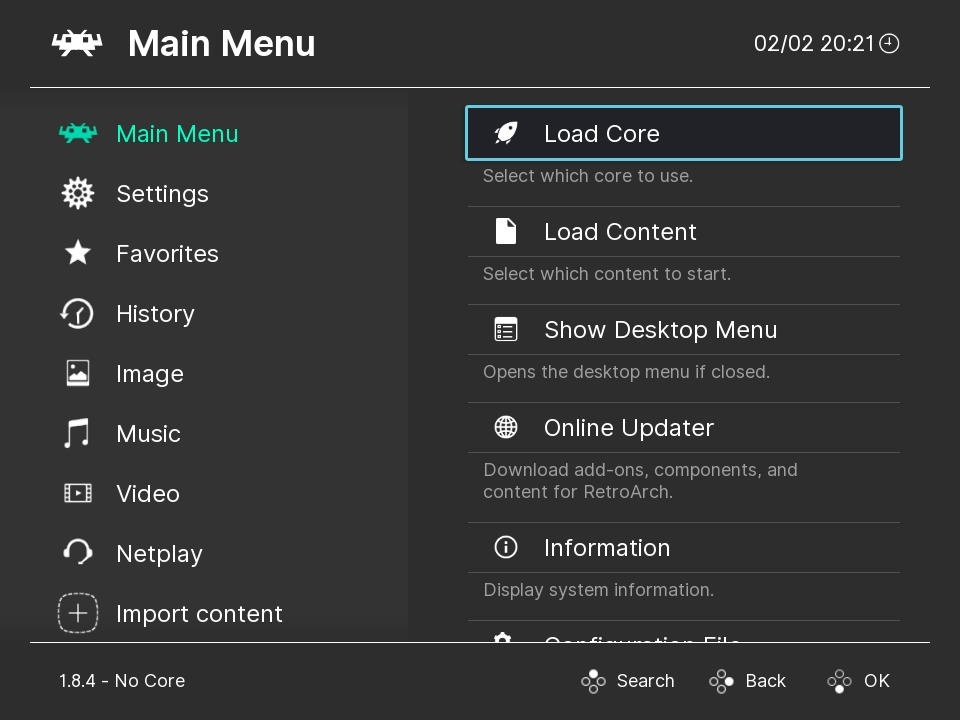

<!--
N.B.: This README was automatically generated by <https://github.com/YunoHost/apps/tree/master/tools/readme_generator>
It shall NOT be edited by hand.
-->

# Retroarch Web Player for YunoHost

[](https://ci-apps.yunohost.org/ci/apps/retroarch/)


[](https://install-app.yunohost.org/?app=retroarch)

*[Read this README in other languages.](./ALL_README.md)*

> *This package allows you to install Retroarch Web Player quickly and simply on a YunoHost server.*  
> *If you don't have YunoHost, please consult [the guide](https://yunohost.org/install) to learn how to install it.*

## Overview

RetroArch is a frontend for emulators, game engines and media players.
It enables you to run classic games on a wide range of computers and consoles through its slick graphical interface. Settings are also unified so configuration is done once and for all.
In addition to this, you are able to run original game discs (CDs) from RetroArch.
RetroArch has advanced features like shaders, netplay, rewinding, next-frame response times, runahead, machine translation, blind accessibility features, and more!


**Shipped version:** 1.16.0~ynh2

**Demo:** <https://web.libretro.com/>

## Screenshots



## Documentation and resources

- Official app website: <http://www.retroarch.com/>
- Official user documentation: <https://docs.libretro.com/>
- Official admin documentation: <https://docs.libretro.com/>
- Upstream app code repository: <https://github.com/libretro/RetroArch>
- YunoHost Store: <https://apps.yunohost.org/app/retroarch>
- Report a bug: <https://github.com/YunoHost-Apps/retroarch_ynh/issues>

## Developer info

Please send your pull request to the [`testing` branch](https://github.com/YunoHost-Apps/retroarch_ynh/tree/testing).

To try the `testing` branch, please proceed like that:

```bash
sudo yunohost app install https://github.com/YunoHost-Apps/retroarch_ynh/tree/testing --debug
or
sudo yunohost app upgrade retroarch -u https://github.com/YunoHost-Apps/retroarch_ynh/tree/testing --debug
```

**More info regarding app packaging:** <https://yunohost.org/packaging_apps>
