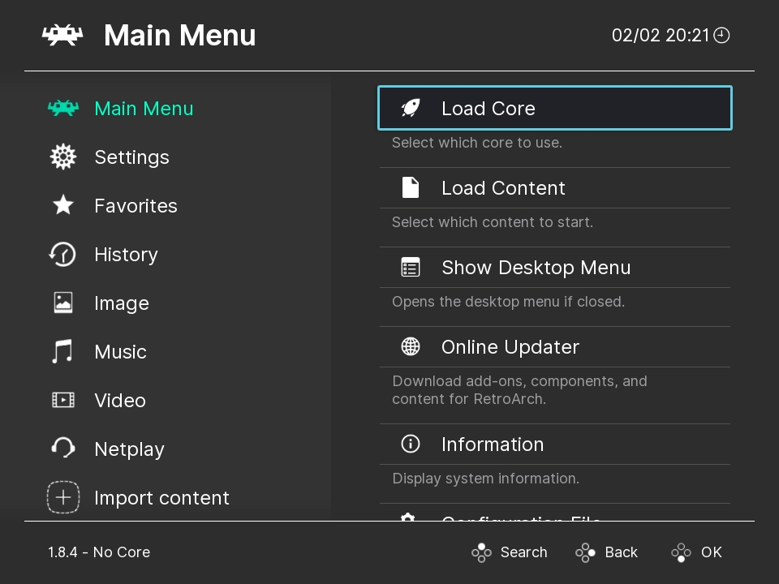

<!--
N.B.: Questo README è stato automaticamente generato da <https://github.com/YunoHost/apps/tree/master/tools/readme_generator>
NON DEVE essere modificato manualmente.
-->

# Retroarch Web Player per YunoHost

[](https://dash.yunohost.org/appci/app/retroarch)  

[](https://install-app.yunohost.org/?app=retroarch)

*[Leggi questo README in altre lingue.](./ALL_README.md)*

> *Questo pacchetto ti permette di installare Retroarch Web Player su un server YunoHost in modo semplice e veloce.*  
> *Se non hai YunoHost, consulta [la guida](https://yunohost.org/install) per imparare a installarlo.*

## Panoramica

RetroArch is a frontend for emulators, game engines and media players.
It enables you to run classic games on a wide range of computers and consoles through its slick graphical interface. Settings are also unified so configuration is done once and for all.
In addition to this, you are able to run original game discs (CDs) from RetroArch.
RetroArch has advanced features like shaders, netplay, rewinding, next-frame response times, runahead, machine translation, blind accessibility features, and more!


**Versione pubblicata:** 1.16.0~ynh1

**Prova:** <https://web.libretro.com/>

## Screenshot



## Documentazione e risorse

- Sito web ufficiale dell’app: <http://www.retroarch.com/>
- Documentazione ufficiale per gli utenti: <https://docs.libretro.com/>
- Documentazione ufficiale per gli amministratori: <https://docs.libretro.com/>
- Repository upstream del codice dell’app: <https://github.com/libretro/RetroArch>
- Store di YunoHost: <https://apps.yunohost.org/app/retroarch>
- Segnala un problema: <https://github.com/YunoHost-Apps/retroarch_ynh/issues>

## Informazioni per sviluppatori

Si prega di inviare la tua pull request alla [branch di `testing`](https://github.com/YunoHost-Apps/retroarch_ynh/tree/testing).

Per provare la branch di `testing`, si prega di procedere in questo modo:

```bash
sudo yunohost app install https://github.com/YunoHost-Apps/retroarch_ynh/tree/testing --debug
o
sudo yunohost app upgrade retroarch -u https://github.com/YunoHost-Apps/retroarch_ynh/tree/testing --debug
```

**Maggiori informazioni riguardo il pacchetto di quest’app:** <https://yunohost.org/packaging_apps>
